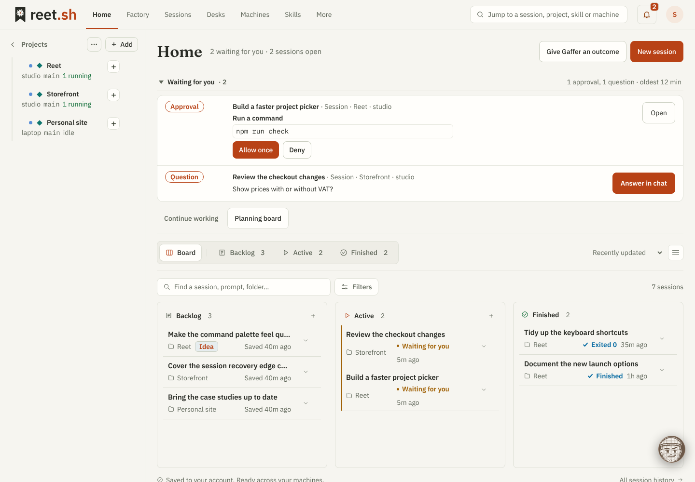
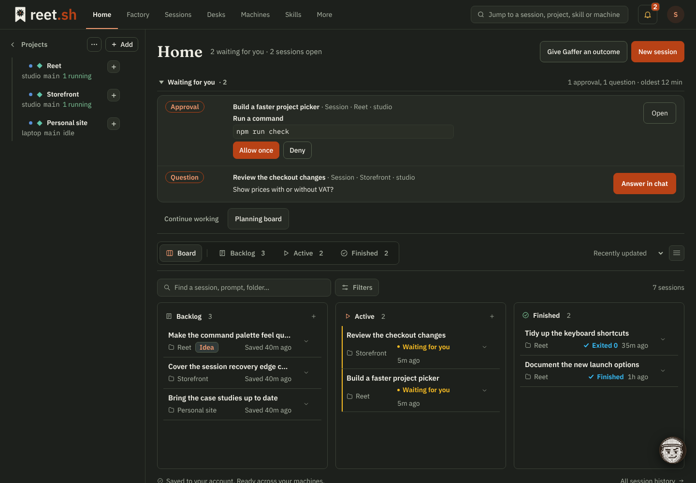
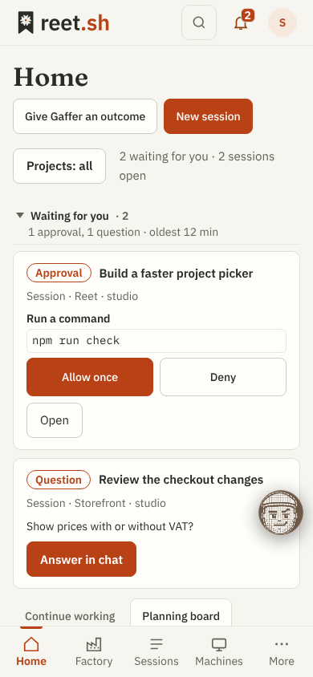
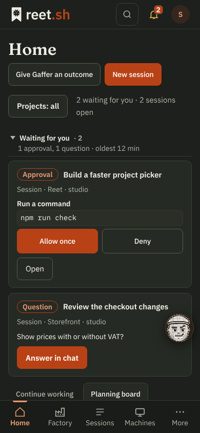

# Session board

{ .screen-light width="1100" }

{ .screen-dark width="1100" }

<details markdown="1">
<summary>Phone view</summary>

{ .screen-light width="390" height="844" }

{ .screen-dark width="390" height="844" }

</details>

Home opens on **Waiting for you**: one list of everything that needs you, whether it
is a [Factory](factory.md) pipeline or a session, with the one that has waited longest
at the top. Each entry says what it needs (a decision, an approval, a merge, a
question, a failure or work to review) and carries the button that deals with it, so
most things can be answered without opening anything. On a wide screen an entry is a
row; on a tablet or phone it is a card. A pipeline shows its stages and, when Gaffer
advised, what it recommends. **Details** opens the pipeline on the Factory page. A
session that has simply finished is not in this list; it is marked **not seen yet** in
Continue working and on the board until you have looked. A Gaffer goal that needs
your review on a session with no pipeline is an entry too. The bell, the number in
the page title and this list count by the same rule on every page; with a project
chosen, this list shows that project's entries while the bell and the title still
count everything. A question the agent of a pipeline asks stays in the list beside
the pipeline's merge or decision unless that decision is the one that answers it. If
the Factory or Gaffer's goals cannot be read, Home says so and keeps what it last
read. When an entry leaves after you answer it or mark it seen, the focus moves to
the next entry (or the one before it).

Two more sections sit under it and start closed: **Factory, working without you**
(the pipelines that are running by themselves, each a link to its place on the
Factory page) and **Your machines**. Every section says what is inside when it is
closed, and your browser remembers which are open; only **Waiting for you** is open
the first time. **Projects** narrows the list: the rail on a wide screen, a
**Projects** button on a tablet or phone.

Under those, the **Continue working** and **Planning board** views are as they were.
The planning board organises session work into **Backlog**, **Active**, and **Finished**. Use
Board to see all three columns, or choose a stage to focus on that stage alone.
View, sort order, and compact cards are remembered in this browser per account.
**New session** starts now and opens the standard **Start an agent** dialog, the
same one the project rail, the machine cards, Machines and Sessions use; a
session to plan instead is added from the Backlog column's **+** or
**Plan a session**.

When **Continue working** has no sessions to show, Home offers **Factory**, an
**agent session**, and a plain **terminal**, in that order. Give Gaffer an outcome
to coordinate, work alongside an agent, or take direct control. Factory's outcome
composer opens on Home; opening it starts no work and makes no model request.
**Plan a session** sits below these choices and opens the existing planning
composer on the board. Closing it returns keyboard focus to **Planning board**.

An account with nothing in flight or saved in the backlog opens this starting view unless you
have already chosen a Home view in this browser. Existing backlog work, chosen
projects and explicit view preferences keep their place. Read failures remain
errors; they are not shown as an empty workspace. Viewers keep the read-only Home.

- **Backlog** contains account-saved prompts that have not reserved a terminal
  session. Create, edit, or delete an item without connecting to its machine.
  Choose a folder project, or a machine and an absolute folder path (empty means
  its home folder), plus an agent, model, and supported effort setting.
- **Active** contains creating, running, and ending sessions. A quiet terminal
  or a completed chat turn remains Active while its session is running.
- **Finished** contains ended, exited, and lost sessions. Their original status
  remains visible: Finished does not imply success. Review opens the existing
  session screen and history. Session actions retain the existing stop, rename,
  and archive behavior.

Search matches title, saved prompt, folder, machine, project, agent, model, and
effort. Filters accept several machines, projects, agents, or models: choices
within a group combine with OR; groups combine with AND. Additional filters show
sessions needing attention and backlog items with reference images. Filter chips
remove individual choices, and Clear all resets the search and filters. Counts
reflect the filtered set in every stage.

Backlog items accept up to four PNG, JPEG, GIF, or WebP images, at most 5 MB each
and 10 MB together. Images are saved privately in SQLite; list responses omit
their bodies. An account can hold 100 unlaunched items and 32 MB of saved JSON
content, including base64 image encoding. Saved images are sent through the
existing machine upload route when Start is pressed, and their machine paths
are appended to the prompt. The complete launch prompt must fit the existing
8,000-byte limit. Model and effort use the same shared picker as the launch bar:
the machine's list, favourites, suggestions, `Other…`, and an honest status line,
with effort offered only for an agent whose catalogue row takes it. The prompt
also has **Use a skill**, which searches the account's shelf and inserts that
skill's ready-to-run prompt at the caret. A skill with an install source gets the
fetch-and-run command; a local skill with no source is used by name (`Use the
<name> skill.`) and shows reet as its source, because its files are already on
the machine. The inserted text is ordinary prompt text, so the person can edit
it, add around it, or delete it.

An item can be saved as an **idea**: a title or a note, with no prompt yet, kept
so it isn't forgotten. Start on an idea opens a dialog to turn it into a session.
Add the prompt, change the agent, model, project, or options if needed, then
choose Start session. The item is saved as a normal backlog item first and then
started like any other. If it could not start, for example because its machine is
offline, the dialog says why and nothing is saved. Cancel leaves the idea as it
was. The server still refuses to start an item that is marked as an idea.

Drag a backlog card onto **Active** to start it without opening the card. A
ready item starts at once, exactly as its Start button would; an idea opens the
same refine-and-start dialog; and an item that cannot start says why instead of
moving. The Start button remains the keyboard route.

Start checks machine readiness, installed agents, image-upload capability, and
project identity. For a plan in a saved repository it also reads where the
session would start (`GET /api/v2/machines/{agentId}/base-check`) before the
images are sent and before the controller is asked to start anything, and asks
first when the branch on the machine and GitHub's differ — the same question and
the same words as the two start dialogs
([Start an agent session](start-agent-session.md#on-home-the-launch-bar)).
**Cancel** leaves the item in the backlog and gives the card's Start the keyboard
back; a check that can't be answered never holds the start up. A frozen retry
carries the request already made, so it is not asked again. The server freezes the launch parameters before dispatch and
uses the backlog item's stable ID as the terminal create request ID. Concurrent
starts and retries reuse that frozen request, including its uploaded image
paths. A definitive refusal before any broker operation is recorded makes the
item editable again. A recorded request is represented by its actual terminal
session, without a duplicate backlog card. After successful dispatch, saved
image bodies are removed; the small launch record remains for retries and is
pruned after 30 days during a subsequent backlog save.

All `/api/v2/session-backlog` routes require a writer's browser account. Writes
require the canonical origin and share the existing folder-project write rate
limit. Updates and deletes require the version that was read; concurrent edits
are refused instead of overwritten. Starting additionally uses the existing
terminal feature, authorization, capability, and audit gates. No prompt or image
body is added to Activity or browser storage. Ordinary agent approvals apply.

Quick launch remains available in an expandable section. New session links from
Sessions and project handoffs open it automatically, and while open it docks to the foot of the
viewport so its prompt and Start stay visible however long the board above it is. Launch links focus
the prompt.
Machine health is in **Your machines**, and what needs you is in **Waiting for you**
and through the bell.
Home refreshes visible data every 15 seconds and keeps the last successful read
when a refresh fails.

Verification:

```sh
cd web
REET_THEME_BASE=HEAD npm run check
npm run build
node tests/session-board.e2e.mjs # local Vite on :5173, Chromium installed
```

Backend tests are `TestSessionBacklog*` in `internal/store` and `internal/api`.
The browser checks use synthetic machines and sessions, and never launch a real
agent. They cover stage views, remembered view, combined filters, image capture,
offline planning, edit/delete/start, light/dark themes, and responsive layouts.
